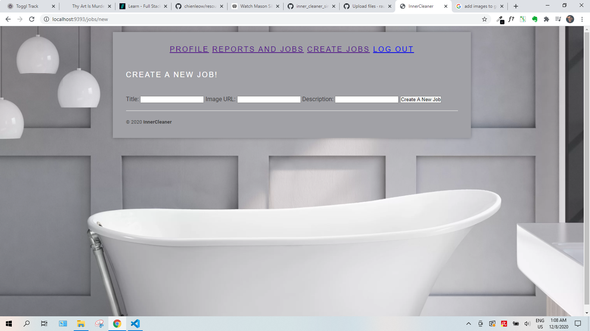

<h2>Welcome to the Inner Cleaner Sinatra App!</h2>

<h4>An application to report the cleanup jobs done by the members of the house.</h4>

<h3>How to start the app:</h3>

1. Git Clone
2. cd into inner_cleaner_sinatra_app
3. Bundle install
4. shotgun
5. visit localhost:9393

<h3>Watch Intro Video here:</h3>

https://www.youtube.com/watch?v=Ln210-k9cf4

<h3>Description:</h3>

Clean up and report the job done.

That way you can know when was the last time you did it.

Add a picture to every job to make sure things look just like you wanted them to.

You can also know who did what and who has been lazy on house duties.

No more arguments over housekeeping with clean reports.

## MIT License 

Copyright (c) 2020 Flatiron School 

Permission is hereby granted, free of charge, to any person obtaining a copy of this software and associated documentation files (the "Software"), to deal in the Software without restriction, including without limitation the rights to use, copy, modify, merge, publish, distribute, sublicense, and/or sell copies of the Software, and to permit persons to whom the Software is furnished to do so, subject to the following conditions:

The above copyright notice and this permission notice shall be included in all copies or substantial portions of the Software.

THE SOFTWARE IS PROVIDED "AS IS", WITHOUT WARRANTY OF ANY KIND, EXPRESS OR IMPLIED, INCLUDING BUT NOT LIMITED TO THE WARRANTIES OF MERCHANTABILITY, FITNESS FOR A PARTICULAR PURPOSE AND NONINFRINGEMENT. IN NO EVENT SHALL THE AUTHORS OR COPYRIGHT HOLDERS BE LIABLE FOR ANY CLAIM, DAMAGES OR OTHER LIABILITY, WHETHER IN AN ACTION OF CONTRACT, TORT OR OTHERWISE, ARISING FROM, OUT OF OR IN CONNECTION WITH THE SOFTWARE OR THE USE OR OTHER DEALINGS IN THE SOFTWARE.

<strong>InnerCleanerApp / ♥ / coded </strong>

